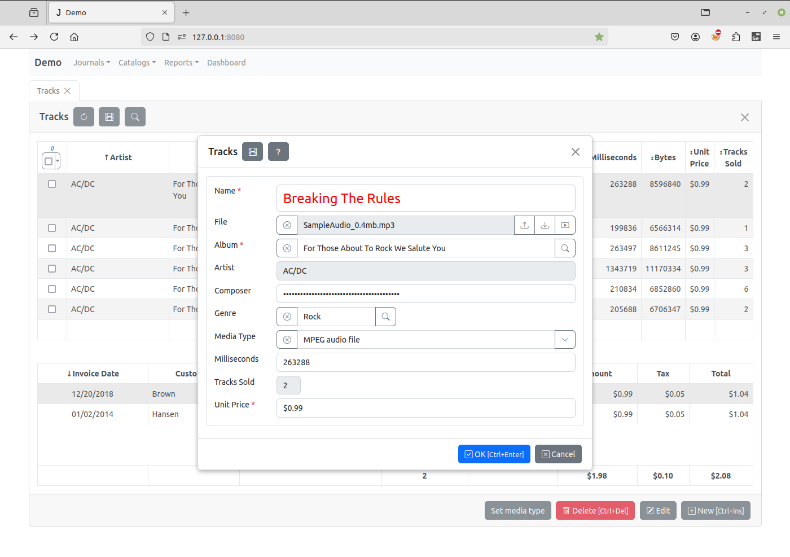
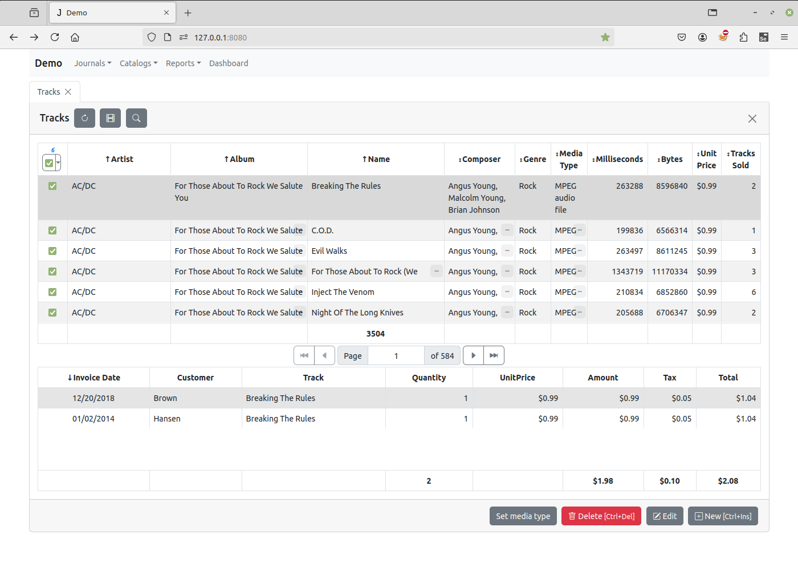
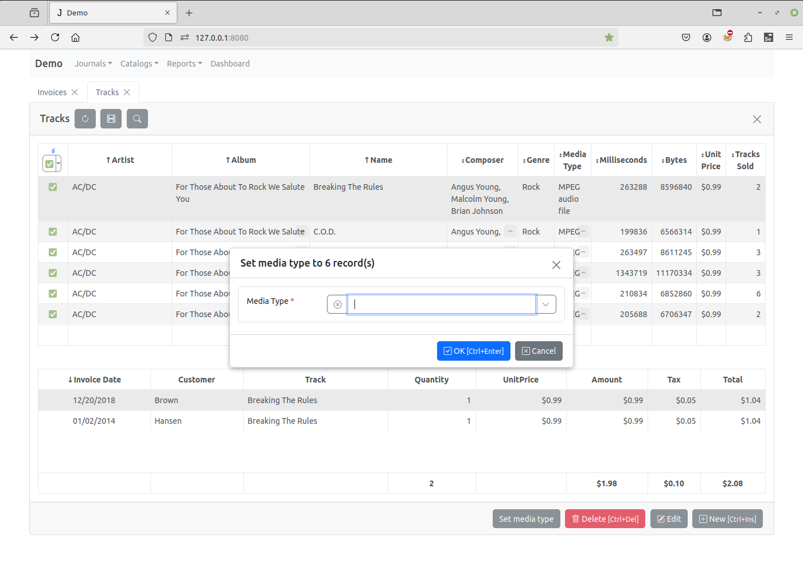
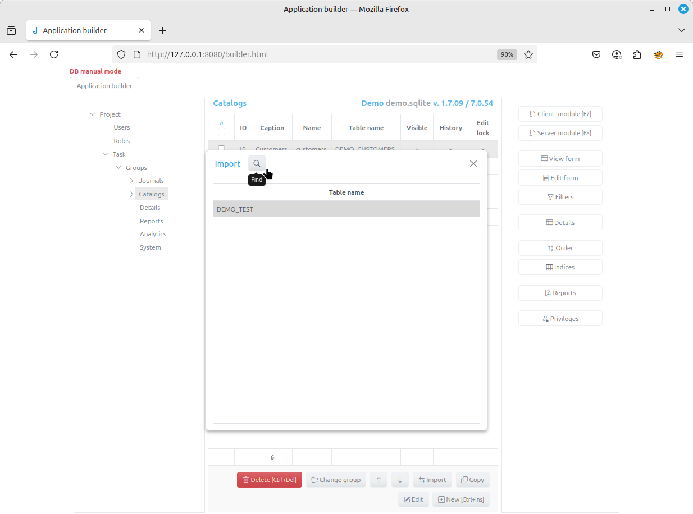
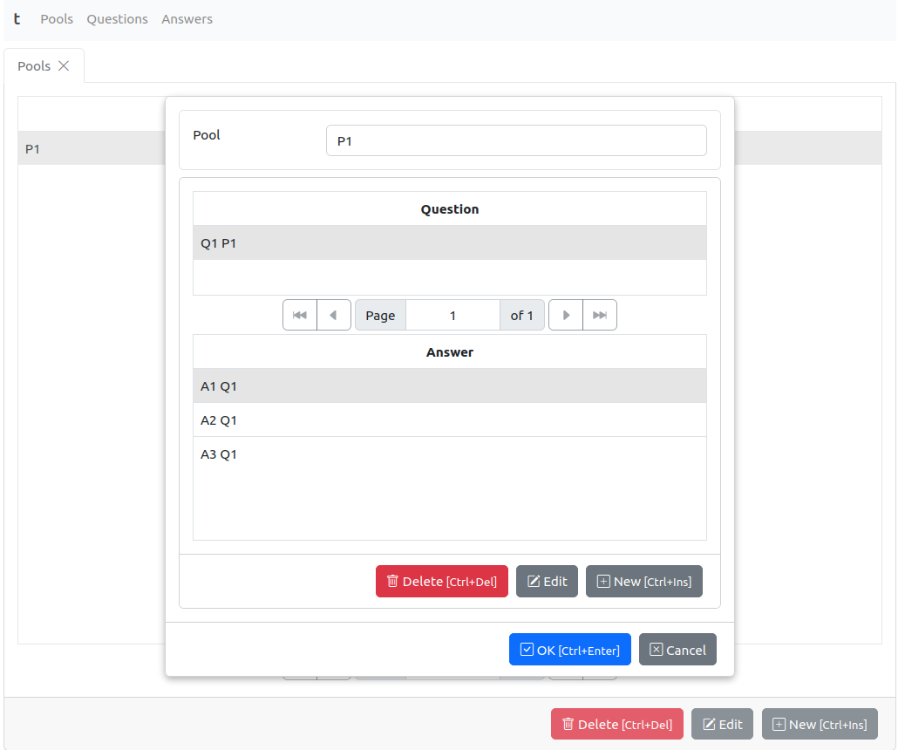

# `Jam.py` - How to

---

## Content

- [00 What is new in v7][00]
- [01 How to write global scope functions][01]
- [02 How to validate field value][02]
- [03 How to add a button to a form][03]
- [04 How to execute Python code from client][04]
- [05 How to change style and attributes of form elements][05]
- [06 How to create a custom menu][06]
- [07 How to append a record using an edit form without opening a view form][07]
- [08 How to prohibit changing record][08]
- [09 How to link two tables][09]
- [10 How to change field value of selected records][10]
- [11 How to save edit form without closing it][11]
- [12 How to save changes to two tables in same transaction on the server][12]
- [13 How to prevent duplicate values in a table field][13]
- [14 How to implement some sort of basic multi-tenancy][14]
- [15 How to immport existing database tables][15]
- [16 How to use data from some other database(s) tables][16]
- [17 How to process a request or get some data from other application or service][17]
- [18 How to perform calculations in the background][18]
- [19 How to have details inside details][19]
- [20 How to export to / import from csv files][20]
- [21 How to write tests][21]
- [22 How to cascade delete records][22]
- [23 How to transfer data between forms][23]
- [24 How to do with custom production html page][24]
- [25 How to migrate development to production][25]
- [26 How to migrate to another database][26]
- [27 How to deploy Jam.py app at Linux Apache http server][27]
- [28 How to do with Nginx with Gunicorn or uvicorn][28]
- [29 How to do increment search by lookup fields][29]

---

## 00 What is new in Jampy v7

1. **There are now permissions for fields**.  
   You can declare some fields as hidden or read only for a role. Hidden fields are not available on the client and couldn't be changed by the user with this role from the browser. Read only fields are disabled in the browser and if changed won't be saved on the server.

2. **There won't be details as a special type**.  
   Any item can be a detail of the other if they are linked by a lookup field. For example, invoices can be a detail of customers because invoices have the customer lookup field whose lookup item is customers.

   This way you don't need to write the code to make an invoice_table a detail of tracks as in the current demo.

3. **There are calculated fields that are also based on lookup fields.**  
   For example, you can have a field that will display the number of sold tracks of the tracks record without writing code.

4. **The unlimited level of nested details is supported.**  

5. **Reading and writing of the data are changed**.  
   The `on_open` and `on_apply` events are deprecated. Instead of them `on_before_open`,  `on_after_open` and `on_before_apply_record`, `on_after_apply_record` events are introduced.

   The `on_before_open` event is triggered before the sql request is executed and can be used to validate the request and add additional filters,  

   The `on_after_open` is triggered after the sql request is executed and has a dataset as a parameter that can be modified before it is sent to the client.

   The `on_before_apply_record` is triggered before the sql query to save the record changes to the database table is executed and can be used for data validation and calculations almost in the same way as it is done on the client now.

   The `on_after_apply_record` is triggered after the sql query to save the record changes is executed and the primary key field is set and can be used to perform other additional changes to the database in the same connection. After the data is saved the `delta` is sent to the client and all changes made to it on the server are updated on the client.

   Changes to a record that have details are processed on the server the following way:

   - First the `on_before_apply_record` event of the master is triggered,
   - then for each detail that has been changed the `on_before_apply_record` event is triggered
   - then that event is triggered for sub detail changes and so on.

   After that in the reverse order the `on_after_apply_record` events are triggered for sub details, details and master. That is true even if changes were made to the detail only.

   That is the changes to the document (record and its details) are saved as a hole.

6. **The code that works with database data is rewritten**.  
   For MSSQL and MYSQL alternative drivers are supported.

7. **The text field size can be changed for databases that have text fields
   with a specified length**.  
   If the new size is bigger, the length of the field is changed, otherwise, the field length remains the same but the app checks that the length text is less than the size value.

8. **The `edit` and `post` methods when charging a record can be omitted**.  
   They are implemented internally.  

9. **In App builder copies (clones) of items could be created.**

10. **It is possible to move items to other groups**.

[Return to Content](#content)

## 01 How to write global scope functions

> [!Note]
> Each function defined in the server or client module of an item becomes an attribute of the item.

Thus, using the task tree, you can access any function declared in the client or server module in any project module.

For example, if we have a function `some_func` declared in the `Customers` client module, we can execute it in any module of the project.

> [!Note]
> The `task` is a global variable on the client.

```js
task.customers.some_func()
```

On the server, the task is not global, but an item that triggered / called it is passed to each event handler and function called by the server method. Therefore, if the `some_func` function is declared in the `Customers` server module, it can be executed in a function or event handler as follows:

```js
def on_apply(item, delta, params):
  item.task.customers.some_func()
```

Note that event handlers are just functions and can also be called from other modules.

> [!Note]
>
> Since the task object on the client is global, it is best to copy it before using it, and work with a copy, which will correctly merge data changes with  calling apple() etc..., and which will not, in doing so, change the metadata of the underlying task object on the client.
>
> This way you won't potentially disrupt the application if you have different objects (items) open in application tabs (not browser tabs - each browser tab gets a fresh client task object).
>
> On the other hand, on the server, the any of task project items gets its own version of the task object, which means you can do whatever you want with it, because you cannot influence the requests of other users who have their own version of the server task object.

[Return to Content](#content)

## 02 How to validate field value

### on_field_validate

Write the `on_field_validate` event handler to validate field value.

For example, the event will triggered when the `post` method is called, that saves the record in memory.

```js
function on_field_validate(field) {
     if (field.field_name === 'unitprice' && field.value <= 0) {
        return 'Unit price must be greater that 0';
    }
}
```

> [!Note]
> This is a field value validation called "on commit". Can be used to check related or dependent fields value in a form, when it is not important that user input is immediatlly stopped for input an incorrect value. This is called on form submit.

### check_field_value and on_edit_form_shown

But for validation only one field value best way is using `check_field_value` function which will be called on way which will prevents the user from leaving the input field when the value does not satisfy validation condition:

```js
function on_edit_form_shown(item) {
    item.each_field( function(field) {
        var input = item.edit_form.find('input.' + field.field_name);
        input.blur( function(e) {
            var err;
            if ($(e.relatedTarget).attr('id') !== "cancel-btn") {
                err = check_field_value(field);
                if (err) {
                    item.alert_error(err);
                    input.focus();
                }
            }
        });
    });
}

function check_field_value(field) {
    if (field.field_name === 'album' && !field.value) {
        return 'Album must be specified';
    }
    if (field.field_name === 'unitprice' && field.value <= 0) {
        return 'Unit price must be greater that 0';
    }
}
```

In `the on_edit_form_shown` event handler we iterate through all the fields using the `each_field` method and find the input for each field, if it exists. Each input has a class with the name of the field (`field_name`).

Then we assign a jQuery `blur` event to it, in which we call the `check_field_value` function, and if it returns text string, we warn the user and focus the input.

Before calling the function, we check whether the "Cancel" button was pressed, and if it was, we break the validation and return from the event handler.

We declared the `on_edit_form_shown` event handler in the item’s module, so it will work in this module only.

### check_field_value and task on_edit_form_shown

We can declare the following event handler in the `task` client module so we can write only `check_field_value` function in any module we need to enable this field validation. The `on_edit_form_shown` of the task is called first for every item when edit form is shown.

```js
function on_edit_form_shown(item) {
    if (item.check_field_value) {
        item.each_field( function(field) {
            var input = item.edit_form.find('input.' + field.field_name);
            input.blur( function(e) {
                var err;
                if ($(e.relatedTarget).attr('id') !== "cancel-btn") {
                    err = item.check_field_value(field);
                    if (err) {
                        item.alert_error(err);
                        input.focus();
                    }
                }
            });
        });
    }
}
```

In this event handler we check if the item has the `check_field_value` attribute, so that we don't raise an exception if we call it and it is not defined for the given item.

[Return to Content](#content)

## 03 How to add a button to a form

The simplest way to add a button to an **edit / view** from is to use `add_edit_button` / `add_view_button` correspondingly. You can call this functions in the `on_edit_form_created` / `on_view_form_created` event handlers.

For example the "Customers" item uses this code in its client module to add buttons to a view form:

```js
function on_view_form_created(item) {
    item.table_options.multiselect = false; 
    if (!item.lookup_field) {   
        var print_btn = item.add_view_button('Print', {image: 'bi bi-printer'}),
            email_btn = item.add_view_button('Send email', {image: 'bi bi-mailbox'});
        email_btn.click(function() { send_email() });
        print_btn.click(function() { print(item) });
        item.table_options.multiselect = true;
    }
}
```

In this code, the item’s `lookup_field` attribute is checked and if it is not defined (the view form is not created to select a value for a lookup field) the two buttons are created and for them JQuery `click` events are assigned to `send_email` and `print` functions declared in that module.

[Return to Content](#content)

## 04 How to execute Python code from client

> [!Note]
> You can use `server` client method to send a request to the server to execute a function defined in the server module of an item.

In the example below we create the btn "button" that is a JQuery object. Then we use its `click` method to attach a function that calls the `server` method of the item to run the calculate function defined in the server module of the item.

The code in the client module:

```js
function on_view_form_created(item) {
    var btn = item.add_view_button('Calculate', {type: 'primary'});
    btn.click(function() {
        item.server('calculate', [1, 2, 3], function(result, error) {
          if (error) {
            item.alert_error(error);
          }
          else {
            console.log(result);
          }
        })
    });
}
```

The code in the server module:

```py
def calculate(item, a, b, c):
    return a + b + c
```

When we click on the button we just created, the result of calling the server function `calculate` will be displayed in our browser's web console.

[Return to Content](#content)

## 05 How to change style and attributes of form elements

### Change DOM elements using JQuery

You can access any DOM element on forms using jQuery.

In the following example, in the `on_edit_form_created` event handler defined the item client module we find the "OK" button, hide it, and change the text of the "Cancel" button to “Close” in the edit form:

```js
function on_edit_form_created(item) {
    item.edit_form.find("#ok-btn").hide();
    item.edit_form.find("#cancel-btn").text('Close');
}
```

When an application creates input controls, it adds a class with a name that is the `field_name` attribute of the corresponding field to each input.

Thus, using the jQuery selectors, we can find the input of the customer field as follows (we select the `input` with the “customer” class in the edit form):

```js
item.edit_form.find("input.customer")
```

Having found the element of the form you can use JQuery methods to change it.

#### JQuery selectors

| Selectors | Type | Description | Example | Description of example |
| --------- | ---- | ----------- | ------- | ---------------------- |
| **Basic** | - | These are the most common selectors, functioning exactly like their CSS counterparts | - | - |
| - | Element / Tag | Selects all elements with the specified `tag name` | `$("p")` | Targets all `<p>` elements. |
| - | ID | Selects a single, unique element using its `id` attribute prefixed with a `#` | `$("#header")` | Targets the element with `id="header"` |
| - | Class | Selects all elements that share a specific class attribute prefixed with a `.` | `$(".btn")` | Targets all elements with `class="btn"` |
| - | Universal | Selects every single element on the current page. | `$("*")` | Targets all elements |
| **Attribute** | - | These filter elements based on the presence or specific values of their HTML attributes | - | - |
| - | Has Attribute | - | `$("a[target]")` | Targets all `<a>` tags that have a target attribute |
| - | Exact Match | - | `$("input[type='text']")` | Targets `<input>` elements specifically where the type is text. |
| - | Starts With | - | `$("a[href^='https']")` | Targets `links` where the href attribute begins with "https" |
| **Positional & Hierarchy** | - | - | - | - |
| - | Filters | These filter elements based on their order or relationship with other elements in the DOM tree | **First & Last**:</br> `$("li:first")` or `$("li:last")` </br> **Even & Odd**:</br> `$("tr:even")` or `$("tr:odd")` </br> **Index-Based**:</br> `(:eq):` </br> **Parent/Child**:</br> `$("div > p")` | Targets only the first or last `<li>` element in a list </br> Targets rows based on parity (highly useful for zebra-striping tables)  `$("li:eq(2)")` </br> Targets the 3rd item in a list (jQuery uses 0-based indexing).  </br> Targets `<p>` elements that are direct children of a `<div>` |
| **Form** | - | jQuery offers shorthand pseudo-selectors specifically designed to make form manipulation easier. | - | - |
| - | All Elements | - | `$(":input")` | Selects all `<input>`, `<textarea>`, `<select>` and `<button>` elements |
| - | By State | - | `$(":checked")` or `$(":disabled")` | Targets checkboxes/radio buttons that are selected, or form fields that are currently disabled. |

#### Quick Comparison Matrix

| Selector Syntax | What it Selects | Pure JS Equivalent |
| --------------- | --------------- | ------------------ |
| `$("div")` | All `<div>` tags | `document.querySelectorAll('div')` |
| `$("#logo")` | Element with ID "logo" | `document.getElementById('logo')` |
| `$(".alert")` | All elements with class `"alert"` | `document.getElementsByClassName('alert')` |
| `$("p:first")` | The very first paragraph | `document.querySelector('p')` |

### Change DOM elements in on_edit_form_shown using CSS - dynamic way

As the field inputs are created by `create_inputs`, after the `on_edit_form_created` event have been triggered, you must write `on_edit_form_shown` event handler to change inputs.

For example this code

```js
function on_edit_form_shown(item) {
  item.edit_form.find('input.name').css('color', 'red');
  item.edit_form.find('input.name').css('font-size', '24px');
  item.edit_form.find('input.tracks_sold').width(20);
  item.edit_form.find('input.genre').parent().width('40%');
  item.edit_form.find('input.composer').prop('type', 'password');
}
```

will change form inputs on this way:



### Change input elements with prepend or append buttons

Please, note that if you need to change the width of input with prepend or append buttons as is:

- inputs of date,
- datetime and
- lookup fields

set the width of the input parent:

```js
item.edit_form.find('input.album').parent().width('50%');
```

### Change DOM elements using CSS - static way

When the task node is selected in the Application Builder, the "project css" button is located on the right pane. Click on it to open the "project.css" file, which is located in the project folder. You can use it to input CSS that defines the style of the DOM elements of the project.

Each item form created in the project has `css classes` that enable developer to identify the form.

Each form has a class identifying it’s type: ‘view-form’, ‘edit-form’, ‘filter-form’ or ‘param-form’.

For example, the following code will remove the images in the buttons at the bottom of the view form:

```js
.view-form .form-footer .btn i {
    display: none;
}
```

More edit form examples:

```js
.edit-form #ok-btn {
    font-weight: bold;
    background-color: lightblue;
}

.edit-form.invoices input.total {
    color: red;
}
```

Also each form has a class with a name that is the `item_name` attribute of the `item`.

The following code will remove images in the buttons only in the Invoices view form:

```js
.view-form.invoices .form-footer .btn i {
    display: none;
}
```

You can change the way tables are displayed. The tables that are created by the `create_table` method have a css class `“dbtable”` and a class with a name that is the `item_name` attribute of the `item`. Each column of the table also has a class with a name that is the `field_name` attribute of the corresponding field.

The example, the following code will display cells of the Invoices table Customer column bold:

```js
.dbtable.invoices td.customer {
    font-weight: bold;
}
```

### Change DOM elements using `on_field_get_html` event handler - dynamic way 2

One more way to change the way the field column is displayed is to write the `on_field_get_html` event handler.

For example:

```js
function on_field_get_html(field) {
    if (field.field_name === 'total') {
        if (field.value > 10) {
            return '<strong>' + field.display_text + '</strong>';
        }
    }
}
```

[Return to Content](#content)

## 06 How to create a custom menu

To create a custom menu you must specify a `custom_menu` option for the task’s `create_menu` method in the task’s client module.

[Return to Content](#content)

## 07 How to append or edit a record using an edit form without opening a view form

### Append a record

You must first call the `open` method of the `item` to initiate its `dataset`. For example, if you want to add a new record to invoices in the Demo application, you can do so as follows:

```js
var invoices = task.invoices.copy();
invoices.open({ open_empty: true });
invoices.append_record();
```

In this code, we create a copy of the item using the `copy` method so that this operation does not affect the Invoices view form if it is open in some other tab.

### Edit a record

You can also change the record, but before you do this, you must get it from the server. Below is the code that modifies the record with `id = 411`. We check that the record exists using the `rec_count` property, otherwise we display a warning.

#### Synchronously way

```js
var invoices = task.invoices.copy();
invoices.open({ where: {id: 411} });
if (invoices.rec_count) {
    invoices.edit_record();
}
else {
    invoices.alert_error('Invoices: record not found.');
}
```

In the example above the open method is executed `synchronously`.

#### Asynchronously way

The code below does it `asynchronously`:

```js
var invoices = task.invoices.copy();
invoices.open({ where: {id: 411} }, function() {
    if (invoices.rec_count) {
        invoices.edit_record();
    }
    else {
        invoices.alert_error('Invoices: record not found.');
    }
});
```

Invoices has the `modeless` attribute set in the Edit form dialog, so the the edit form will be opened in a tab. You can change it by setting `modeless` attribute of edit_options to make the edit form modal:

```js
var invoices = task.invoices.copy();
invoices.edit_options.modeless = false;
```

[Return to Content](#content)

## 08 How to prohibit changing record

### Prohibit change of item in dependent a vield value

Let’s assume that we have an item with a boolean field with `field_name = posted`, and if the value of the field is `true`, we must prohibit changing or deleting the record.

We can do this by writing the `on_after_scroll` event handler and using the `permissions` property:

```js
function on_after_scroll(item) {
    if (item.rec_count) {
        item.permissions.can_edit = !item.posted.value;
        item.permissions.can_delete = !item.posted.value;
        if (item.view_form) {
            item.view_form.find("#delete-btn").prop("disabled", item.posted.value);
            item.view_form.find("#edit-btn").prop("disabled", item.posted.value);
        }
    }
}
```

In this event handler we check the value of the `posted` field and set the permissions property attributes to not of its value.

> [!Note]
>
> Above code can be a part of management the "state" item scenario!

### Prohibit change of item by writing `on_apply` event handler

We can also write the `on_apply` event handler in the server module of the item:

```js
def on_apply(item, delta, params, connection):
  for d in delta:
      if d.posted.old_value:
          raise Exception('Document posted. No change allowed')
```

> [!Note]
>
> - Result is the same as is above. But this is better way, if your target is not dynamically access management to buttons of a form.
>
> - Also, this code can be a part of management the "state" item scenario!.

</br>

> [!Note]
>
> A `delta` is a set of changed records of the current dataset. This means that at any given time we have three different sets of data:
>
> - current item dataset
> - current dataset item changes - `delta`, compared to the loaded dataset item
> - item table dataset
>
> Calling the item's `apply` method synchronizes all of three.
>
> To get the loaded values, we can refer to the `old_value` of any field in the `delta` dataset.

[Return to Content](#content)

## 09 How to link two tables

The below procedure was valid for `Jam.py V5`, for the scenario when the two database tables were not directly linked by a `Master/Detail` relationship within the `Builder`.

In `Jam.py V7`, the database table Tracks is directly linked to the detail table invoice_table, hence the below procedure is not needed.

If the tables were not directly linked within the Builder, we could still use the this procedure with `Jam.py` V7.

> [!Note]
>
> This procedure only makes sense if we are doing a custom GUI setup to display these linked tables in both view and edit mode. Since V7 Jampy has a default setup, which is obtained by elementary manipulations in the ViewForm and EditForm Builder.

We’ll explain how to link two items on example of the `Tracks` and `invoice_table` items from the Demo application.

The default behavior of `view_form` is defined in the `on_view_form_created` event handler declared in the task client module.

We will change it in the `on_view_form_created` event handler in the tracks client module

```js
function on_view_form_created(item) {
  item.table_options.height -= 200;
  item.invoice_table = task.invoice_table.copy();
  item.invoice_table.paginate = false;
  item.invoice_table.create_table(item.view_form.find('.view-detail'), {
      height: 200,
      summary_fields: ['date', 'total'],
  });
}
```

- We reduce height of the table that displays `tracks` data by 200 pixels
- then we create a copy of `invoice_table`,
- set its `paginate` attribute to `false` and
- call the `create_table` method to create a table that will display the sold tracks
- for this table we set the height to 200 pixels and
- define summary fields.

This table will always be empty if we won’t define the following `on_after_scroll` event handler:

```js
function on_after_scroll(item) {
    if (item.view_form.length) {
      if (item.rec_count) {
          item.invoice_table.set_where({track: item.id.value});
          item.invoice_table.set_order_by(['-invoice_date']);
          item.invoice_table.open(true);
      }
      else {
          item.invoice_table.close();
      }
    }
}
```

The `on_after_scroll` event is triggered whenever the current record of the `Tracks` item is changed.

So when the track is changed we call `open` method with pre-setting the `filter` and `order` of `invoice_table` item.

This method sends a request to the server, that generates sql query, executes it and returns a dataset that contains sold records of this track ordered in `descending` order of `invoice_date` field.

If the tracks dataset is empty we clear the sold records dataset by calling the `close` method.

Because controls in `Jam.py` are data-aware every change of sold records dataset will be displayed in the table that we created in the `on_view_form_created` event handler.

Now every time the track has changed the application send request to the server to renew the sold tracks. This is not effective and sometimes can lead to delays. To avoid this we use the JavaScript `setTimeout` function:

```js
var scroll_timeout;

function on_after_scroll(item) {
    if (!item.lookup_field && item.view_form.length) {
        clearTimeout(scroll_timeout);
        scroll_timeout = setTimeout(            
            function() {
                if (item.rec_count) {
                    item.invoice_table.set_where({track: item.id.value});
                    item.invoice_table.set_order_by(['-invoice_date']);
                    item.invoice_table.open(true);
                }
                else {
                    item.invoice_table.close();
                }
            },
            100
        );
    }
}
```

This function guarantees that the data will be updated no more than once every 100 milliseconds.

Since the `invoice_table` is a detail it has the `invoice` field that stores a reference to invoice, we can show the user an invoice that contains the current sold record.

To do so we pass to the `create_table` method the function that will be executed when user double click the record:

```js
item.invoice_table.create_table(item.view_form.find('.view-detail'), {
    height: 200,
    summary_fields: ['date', 'total'],
    on_dblclick: function() {
        show_invoice(item.invoice_table);
    }
});
```

and define the function "show_invoices" as follows:

```js
function show_invoice(invoice_table) {
    var invoices = task.invoices.copy();
    invoices.set_where({id: invoice_table.invoice.value});
    invoices.open(function(i) {
        i.edit_options.modeless = false;
        i.can_modify = false;
        i.invoice_table.on_after_open = function(t) {
            t.locate('id', invoice_table.id.value);
        };
        i.edit_record();
    });
}
```

In this function we create a copy of the `invoices` journal and find the invoice. When the open method is executed we will show the invoice by calling its `edit_record` method. But before calling it we set its attributes so that it will be modal and the user won’t be able to modify it.

Besides we dynamically assign `on_after_open event` handler to the `invoice_table` detail of the `invoice` we get. In this event handler we will find the current record in the sold records by calling the locate method.

Finally we will check the `lookup_field` attribute of tracks. This attribute is `true` if the item was created to select a value for the lookup field when a user clicks on the button to the right of lookup field input. We will make so that the sold tracks are not shown when the user selects the value for the lookup field.

In addition, we add an `alert` informing the user about the possibility of seeing the invoice.

Finally the code of the `on_view_form_created` will be as follows:

```js
function on_view_form_created(item) {
    if (!item.lookup_field) {
        item.table_options.height -= 200;
        item.invoice_table = task.invoice_table.copy();
        item.invoice_table.paginate = false;
        item.invoice_table.create_table(item.view_form.find('.view-detail'), {
            height: 200,
            summary_fields: ['date', 'total'],
            on_dblclick: function() {
                show_invoice(item.invoice_table);
            }
        });
        item.alert('Double-click the record in the bottom table ' +
          'to see the invoice in which the track was sold.');
    }
}

var scroll_timeout;

function on_after_scroll(item) {
    if (!item.lookup_field && item.view_form.length) {
        clearTimeout(scroll_timeout);
        scroll_timeout = setTimeout(
            function() {
                if (item.rec_count) {
                    item.invoice_table.set_where({track: item.id.value});
                    item.invoice_table.set_order_by(['-invoice_date']);
                    item.invoice_table.open(true);
                }
                else {
                    item.invoice_table.close();
                }
            },
            100
        );
    }
}

function show_invoice(invoice_table) {
    var invoices = task.invoices.copy();
    invoices.set_where({id: invoice_table.invoice.value});
    invoices.open(function(i) {
        i.edit_options.modeless = false;
        i.can_modify = false;
        i.invoice_table.on_after_open = function(t) {
            t.locate('id', invoice_table.id.value);
        };
        i.edit_record();
    });
}
```



In a similar way we could link Tracks with Customers items from the Demo application:

```js
function on_view_form_created(item) {
    if ($(window).width() < 480) {
        item.table_options.height = 400;
    }
    if (!item.lookup_field) {
        item.table_options.height -= 200;
        item.invoices = task.invoice_table.copy();
        item.invoices.paginate = false;
        item.invoices.create_table(item.view_form.find('.view-detail'), {
            height: 200,
            summary_fields: ['invoice_date', 'total', 'quantity'],
        });

    }
}

var scroll_timeout;

function on_after_scroll(item) {
    if (!item.lookup_field && item.view_form.length) {
        clearTimeout(scroll_timeout);
        scroll_timeout = setTimeout(
            function() {
                if (item.rec_count) {
                    item.invoices.set_where({customer__contains: item.lastname.value});
                    item.invoices.set_order_by(['-invoice_date']);
                    item.invoices.open(true);
                }
                else {
                    item.invoices.close();
                }
            },
            100
        );
    }
}
```

The variation of:

```js
item.invoices.set_where({customer__contains: item.lastname.value}); 
```

in the above code will produce different results.

[Return to Content](#content)

## 10 How to change field value of selected records

In this example, we will show how to change the `Media Type` field of the `Tracks` catalog to the same value for the selected records.



First we set the `multiselect` attribute of the `table_options` to `true` to display the check box in the leftmost column of the `Tracks` table for the user to select the records and create the `Set media` type button in the `on_view_form_created` event handler in the client module of `Tracks`.

```js
function on_view_form_created(item) {
  item.table_options.multiselect = true;
  item.add_view_button('Set media type').click(function() {
      set_media_type(item);
  });
}
```

When this button is pressed, the `set_media_type` function defined in the module is executed.

In this function we create a copy of the `Tracks` item. We pass to the `copy` method the `handlers` option equal to `false`. It means that all the settings to the item made in the Form Dialogs in the Application Builder and all the functions and events defined in the client module of the item will be unavailable to the copy.

Then we analyze the `selections` attribute that is the array of the values of primary key field of the records, selected by the user.

After it we initialize the dataset of the copy by calling the `open` method with `open_empty` option. We also set the fields options so that the dataset will have only one field `media_type`. We set the required attribute of that field to true.

And finally, before calling the `append_record` method, we dynamically assign the `on_edit_form_created` event handler to change the on click event of the OK button, that was defined in the client module of the task.

In the new on click event handler we, first, call the `post` method to check that the `media type` value is set, if exception is raised we call `edit` method to allow the user to set it.

```js
function set_media_type(item) {
    var copy = item.copy({handlers: false}),
        selections = item.selections;
    if (selections.length > 1000) {
        item.alert('Too many records selected.');
    }
    else if (selections.length || item.rec_count) {
        if (selections.length === 0) {
            selections = [item.id.value];
        }

        copy.open({fields: ['media_type'], open_empty: true});

        copy.edit_options.title = 'Set media type to ' + selections.length +
          ' record(s)';
        copy.edit_options.history_button = false;
        copy.media_type.required = true;

        copy.on_edit_form_created = function(c) {
            c.edit_form.find('#ok-btn').off('click.task').on('click', function() {
                try {
                    c.post();
                    item.server('set_media_type', [c.media_type.value, selections],
                      function(res, error) {
                        if (error) {
                            item.alert_error(error);
                        }
                        if (res) {
                            item.selections = [];
                            item.refresh_page(true);
                            c.cancel_edit();
                            item.alert(selections.length + '
                              record(s) have been modified.');
                        }
                      }
                    );
                }
                finally {
                    c.edit();
                }
            });
        };
        copy.append_record();
    }
}
```

When the user clicks the OK button, the item’s `server` method executes the `set_media_type` function on the server, which changes the field value of the selected records.

After changing the records on the server we, on the client, unselect the records, refresh the data of the page, cancel editing by calling the `cancel_edit method` and inform the user of the results.

```py
def set_media_type(item, media_type, selections):
    copy = item.copy()
    copy.set_where(id__in=selections)
    copy.open(fields=['id', 'media_type'])
    for c in copy:
        c.edit()
        c.media_type.value = media_type
        c.post()
    c.apply()
    return True
```

[Return to Content](#content)

## 11 How to save edit form without closing it

You can do it by adding a button that will save the record without closing the edit form.

Below is examples for `synchronous` and `asynchronous` cases.

```js
function on_edit_form_created(item) {
    var save_btn = item.add_edit_button('Save and continue');
    save_btn.click(function() {
        if (item.is_changing()) {
            item.post();
            try {
              item.apply();
            }
            catch (e) {
              item.alert_error(error);
            }
            item.edit();
        }
    });
}
```

```js
function on_edit_form_created(item) {
    var save_btn = item.add_edit_button('Save and continue');
    save_btn.click(function() {
        if (item.is_changing()) {
            item.disable_edit_form();
            item.post();
            item.apply(function(error){
                if (error) {
                    item.alert_error(error);
                }
                item.edit();
                item.enable_edit_form();
            });
        }
    });
}
```

[Return to Content](#content)

## 12 How to save changes to two tables in same transaction on the server

> [!Note]
>
> Signature of the item `apply` method is:
>
> **apply(self, connection=None, params=None, safe=False)**:
>
> This method of the item writes all updated, inserted, and deleted records from a item dataset to a database.
>
> - if **connection** parameter is specified the appication uses it to execute sql query that it generates (it doesn’t commit changes and doesn’t close the connection),
>
> - otherwise it procures a **connection** from the task connection pool that will be returned to the pool after changes are commited.

Below are two examples.

In the first example each `apply` method gets its own `connection` from `connection pool` and commits it after saving changes to the database.

In the second example the `connection` is received from `connection pool` and passed to each `apply` method so changes are committed at the end.

```py
import datetime

def change_invoice_date(item, invoice_id):
    now = datetime.datetime.now()

    invoices = item.task.invoices.copy(handlers=False)
    invoices.set_where(id=invoice_id)
    invoices.open()
    invoices.edit()
    invoices.invoice_date.value = now
    invoices.post()
    invoices.apply()

    customer_id = invoices.customer.value
    customers = item.task.customers.copy(handlers=False)
    customers.set_where(id=customer_id)
    customers.open()
    customers.edit()
    customers.last_modified.value = now
    customers.post()
    customers.apply()
```

```py
import datetime

def change_invoice_date(item, invoice_id):
    now = datetime.datetime.now()

    con = item.task.connect()
    try:
        invoices = item.task.invoices.copy(handlers=False)
        invoices.set_where(id=invoice_id)
        invoices.open()
        invoices.edit()
        invoices.invoice_date.value = now
        invoices.post()
        invoices.apply(con)

        customer_id = invoices.customer.value
        customers = item.task.customers.copy(handlers=False)
        customers.set_where(id=customer_id)
        customers.open()
        customers.edit()
        customers.last_modified.value = now
        customers.post()
        customers.apply(con)

        con.commit()
    finally:
        con.close()
```

[Return to Content](#content)

## 13 How to prevent duplicate values in a table field

### First way: Write `on_apply` event handler

In the example below, the `delta` parameter is a dataset that contains the changes that will be stored in the users table.

We go through records of changes.

If the record was not deleted or the login field didn’t change we look for a record in the table with the same login and if it exists `raise the exception`.

If the user is editing the record on the client using an edit form he won’t be able to save it and will see the corresponding alert message.

```py
def on_apply(item, delta, params, connection):
    for d in delta:
        if not (d.rec_deleted() or d.rec_modified() and d.login.value == d.login.old_value):
            users = d.task.users.copy(handlers=False)
            users.set_where(login=d.login.value)
            users.open(fields=['login'])
            if users.rec_count:
                raise Exception('There is a user with this login - %s' % d.login.value)
```

### Second way: Use th unique key

> [!Note]
>
> For a long time, in modern databases, this operation has been performed by setting a UNIQUE constraint on a field whose value cannot be repeated.

**Example for PostgreSQL database**:

A PostgreSQL `UNIQUE` constraint ensures that all values in a column or a group of columns are distinct across the entire table. When you add a unique constraint, PostgreSQL automatically creates a behind-the-scenes unique B-tree `index` to enforce it efficiently.

- **Single-Column Unique Constraint**  

  You can define a unique constraint directly on a column when creating a new table.
  
  ```sql
  CREATE TABLE users (
    id SERIAL PRIMARY KEY,
    email TEXT UNIQUE -- Column-level constraint
  );
  ```

- **Multi-Column Unique Constraint**

  If you need a combination of columns to be unique, you must declare it as a table-level constraint.
  
  ```sql
  CREATE TABLE company_branches (
    id SERIAL PRIMARY KEY,
    company_name TEXT,
    location_city TEXT,
    UNIQUE (company_name, location_city) -- Table-level constraint
  );
  ```

  In this example, multiple rows can have "London" as the city, and multiple rows can have "Google" as the company, but there can only be one row where the company is "Google" and the city is "London".

- **Adding and Removing Constraints on Existing Tables**

  If your table already exists, use `ALTER TABLE` to manage constraints.

  - **Add a unique constraint**
  
    ```sql
    ALTER TABLE users 
    ADD CONSTRAINT unique_user_email UNIQUE (email);
    ```
  
    **Note**: This will fail if your table already contains duplicate values in that column.

  - **Drop a unique constraint**
  
    ```sql
    ALTER TABLE users 
    DROP CONSTRAINT unique_user_email;
    ```

- **Handling NULL Values**
  By default, standard SQL treats NULL values as completely distinct one from another. This means you can insert multiple rows with NULL into a standard `unique` column. If you want to treat NULL values as equal (meaning you only allow one NULL in that column), you can use the `NULLS NOT DISTINCT` modifier:
  
  ```sql
  -- Treats multiple NULLs as duplicate violations
  CREATE TABLE products (
    product_id INT,
    serial_number TEXT,
    CONSTRAINT unique_serial UNIQUE NULLS NOT DISTINCT (serial_number)
  );
  ```

[Return to Content](#content)

## 14 How to implement some sort of basic multi-tenancy

If some item has a `user_id` field (type INT), the following code in the server module of the item will do the job. The authentication must be enabled:

```py
def on_open(item, params):
    if item.session:
        user_id = item.session['user_info']['user_id']
        if user_id:
            params['__filters'].append(['user_id', item.task.consts.FILTER_EQ, user_id])

def on_apply(item, delta, params, connection):
    if item.session:
        user_id = item.session['user_info']['user_id']
        if user_id:
            for d in delta:
                if d.rec_inserted():
                    d.edit()
                    d.user_id.value = user_id
                    d.post()
                elif d.rec_modified():
                    if d.user_id.old_value != user_id:
                        raise Exception('You are not allowed to change record.')
                elif d.rec_deleted():
                    if d.user_id.old_value != user_id:
                        raise Exception('You are not allowed to delete record.')
```

It uses a `session` attribute of the item to get a unique user id and `on_open` and `on_apply` event handlers.

The `on_open` event handler ensures that the sql select statement that applications generates will return only records where the `user_id` field will be the same as the ID of the user that sends the request.

And the `on_apply` event handler sets the `user_id` to the ID of the user that appended or modified the records.

You can use a more general approach and add the following code to the server module of the task. Then a multi-tenancy will be applied to every item that has a `user_id` field:

```py
def on_open(item, params):
    if item.field_by_name('user_id'):
        if item.session:
            user_id = item.session['user_info']['user_id']
            if user_id:
                params['__filters'].append(['user_id', item.task.consts.FILTER_EQ, user_id])

def on_apply(item, delta, params, connection):
    if item.field_by_name('user_id'):
        if item.session:
            user_id = item.session['user_info']['user_id']
            if user_id:
                for d in delta:
                    if d.rec_inserted():
                        d.edit()
                        d.user_id.value = user_id
                        d.post()
                    elif d.rec_modified():
                        if d.user_id.old_value != user_id:
                            raise Exception('You are not allowed to change record.')
                    elif d.rec_deleted():
                        if d.user_id.old_value != user_id:
                            raise Exception('You are not allowed to delete record.')
```

The user might combine the above with the authentication.

[Return to Content](#content)

## 15 How to import existing database tables

For importing existing database tables:

- Create a new project with connection to existing database.

- Select Project node and click Database button. Set `DB manual mode` to `true`.

- Select `Group` you want to import a table to and click `Import` button.

- In the form that will appear dbl click on the table to import it.



- In the `Item Editor Dialog` check that all fields have valid types. If field type is displayed in the red, try to select appropriate type.

- You can import a subset of fields in the table.

- Before saving, specify the primary key field for the item and generator name, if necessary.

- After saving the imported item, go to the project page and check how it is displayed.

- After importing several tables, you can specify lookup fields (in DB manual mode).

> [!Note]
>
> - Please, do be very careful when performing this operations.
>
>   When `DB manual mode` is removed any changes to the item will be reflected in the corresponding DB table. If you delete the item, the table will be dropped from the database.
>
> - The database table to be imported must have a primary key with one field.
>
> - Binary fields must not be imported.
>
> - The indexes are not imported.

[Return to Content](#content)

## 16 How to use data from some other database(s) tables

You can use data from other database tables.

It is not possible to use fields as Lookups on other tables this way.

### First way - Connect to other database and import tables

First you must specify table name and fields information. You can do it the following way:

- Select project node in the task tree and click Database button.

- Set `DB manual mode`.

- Specify the database connection attributes for external database table.

- Import tables information as described in the `Integration with existing database`.

- Select project node in the task tree, click Database button and restore previous values.

### Second way - manualy create each tabele and fields

The other method is to manually create each table and fields matching the source.

The `DB manual mode` must be set.

Then in the Server module for the new items, add code to read and write the data to the database tables by using `on_open` and `on_apply` with `create_connection_ex`.

Below code was tested with V7 for MySQL, MSSQL and PostgreSQL database (auto incremented primary field):

```py
import mysql-connector-python
from jam.db.mysql_db2 import db
from jam.items import QueryData

def on_open(item, params):
    connection = item.task.create_connection_ex(
        db,
        database='jam2',
        user='jam',
        password='jam',
        server='localhost',
        port='3307',
    )
    try:
        query_data = QueryData(params)
        sql, sql_params = db.get_select_query(item, query_data)
        rows = item.task.select(sql, connection, db, sql_params)
    finally:
        connection.close()
    return rows, ''

def on_apply(item, delta, params, con):
    connection = item.task.create_connection_ex(
        db,
        database='jam2',
        user='jam',
        password='jam',
        server='localhost',
        port='3307',
    )
    try:
        result = delta.apply_delta(delta, params, connection, db)
        connection.commit()
    finally:
        connection.close()
    return result
```

Import example for MSSQL, the rest of code as for MySQL:

```py
import pymssql
from jam.db.mssql_db1 import db
from jam.items import QueryData
...
```

Import example for PostgreSQL, the rest of code as for MySQL:

```py
import psycopg2-binary
from jam.db.postgres_db import db
from jam.items import QueryData
```

> [!Note]
>
> The below procedure was not tested with `Jam.py` V7.

If database use generators to get primary field values, you must specify them for new records (Firebird):

```py
import fdb
from jam.db import firebird

def on_open(item, params):
    connection = item.task.create_connection_ex(firebird, database='demo.fdb', \
        user='SYSDBA', password='masterkey', encoding='UTF8')
    try:
        sql = item.get_select_query(params, firebird)
        rows = item.task.select(sql, connection, firebird)
    finally:
        connection.close()
    return rows, ''

def get_id(table_name, connection):
    cursor = connection.cursor()
    cursor.execute('SELECT NEXT VALUE FOR "%s" FROM RDB$DATABASE' % (table_name + '_SEQ'))
    r = cursor.fetchall()
    return r[0][0]

def on_apply(item, delta, params):
    connection = item.task.create_connection_ex(firebird, database='demo.fdb', \
        user='SYSDBA', password='masterkey', encoding='UTF8')
    for d in delta:
        if not d.id.value:
            d.edit()
            d.id.value = get_id(item.table_name, connection)
            for detail in d.details:
                for r in detail:
                    if not r.id.value:
                        r.edit()
                        r.id.value = get_id(r.table_name, connection)
                        r.post()
            d.post()
    try:
        sql = delta.apply_sql(params, firebird)
        result = item.task.execute(sql, None, connection, firebird)
    finally:
        connection.close()
    return result
```

> [!Note]
>
> Do not set `History` attribute to `True` for this tables. If you do so you’ll get the exception. `History` table must be one for all databases that you use in the project. You can try to create the history table in the other database and write the `on_open` and `on_apply` event handlers for it.

[Return to Content](#content)

## 17 How to process a request or get some data from other application or service

You can access the data of your application for reading and writing by sending a post request that has `ext` added to url. For example:

```html
http://your_jampy_app.com/ext/something
```

When an web app on the server receives such request, it generates the `on_ext_request` event.

For example, `Jam.py` application `table account_transactions` has a field `actual_amount`. The application Task Module has:

```py
def on_ext_request(task, request, params):
    reqs = request.split('/')
    if reqs[2] == 'expenses':
        result = task.account_transactions.expenses(task, params)
        return result
```

The table `account_transactions` Task Server Module has:

```py
from jam.common import cur_to_str

def expenses(item, params):
    inv = item.task.account_transactions.copy()
    inv.open()
    total = 0
    for i in inv:
        total += i.actual_amount.value

    total = cur_to_str(total)
    return(total)
```

Accessing the application with Curl command will reply with the result:

```sh
curl -k https://your_jampy_app.com/ext/expenses -d "[]" -H  "Content-Type: application/json"

{"result": {"status": 9, "data": "-$2590.01", "modification": 99}, "error": null}
```

[Return to Content](#content)

### Using variables with Curl

On Demo application, if we add to Task Server Module:

```py
def on_ext_request(task, request, params):
    print(request, params)
    reqs = request.split('/')
    if reqs[2] == 'bla':
        users = task.customers.copy(handlers=False)
        users.set_where(id=params['id'])
        users.open()
        if users.rec_count == 1:
                return {
                    'id': users.firstname.value,
                    'firstname': users.firstname.value,
                }
```

Passing parameters with Curl will reply with the result:

```sh
curl  http://localhost:8080/ext/bla -d '{"id": "2", "firstname": "Leonie"}' -H "Content-Type: application/json"

{"result": {"status": 9, "data": {"id": "Leonie", "firstname": "Leonie"}, "modification": 2014}, "error": null}
```

[Return to Content](#content)

### Consuming data from the request

The same application from above can be accessed from some other `Jam.py` app with Server Module:

```py
try:
    # For Python 3.0 and later
    from urllib.request import urlopen
except ImportError:
    # Fall back to Python 2's urllib2
    from urllib2 import urlopen

import json
import time

params = []

def api_fetch(url, request, params):
    try:
        a = urlopen(url + '/' + request, data=str.encode(json.dumps(params)))
        r = json.loads(a.read().decode())
        return r['result']['data']
    except:
        return False


def send(item):
    result= ''
    res = []
    request = 'expenses';
    endpoint = 'https://your_jampy_app.com/ext';

    try:
        # print('Req: ' + request)
        result = api_fetch(endpoint, request, [])
    except:
        return False
    if result:
        # print(result)
        res.append(
            {
                # 'id': 1,
                'request': request,
                'endpoint': endpoint,
                'value': result,
            }
        )
        return res
    else:
        raise Exception('Could not connect!')
```

Client Module for some virtual table with fields request, endpoint, and value:

```js
function on_view_form_created(item) {
    item.view_options.open_item = false;
    item.view_options.form_header = false;
    item.open({open_empty: true});
    item.paginate = false;
    item.view_form.find("#edit-btn").hide();
    item.view_form.find("#delete-btn").hide();
    item.view_form.find("#new-btn").hide();
    item.alert('Fetching!');
    item.server('send', function(records, err) {
        item.disable_controls();
        if (err) {
            item.warning('Failed to fetch data: ' + err);
        }
        else {
            if (records.length > 0) {
                records.forEach(function(rec) {
                    item.append();
                    // item.id.value = rec.id;
                    item.request.value = rec.request;
                    item.endpoint.value = rec.endpoint;
                    item.value.value = rec.value;
                    item.post();
                });
                item.first();
                item.enable_controls();
                item.alert('Successfully fetched from API!');
            }
        }
    });
}
```

The result will be displayed table with fetched value from endpoint with the request.

[Return to Content](#content)

## 18 How to perform calculations in the background

You can use this code in the task server module to run a background thread in the web application once a 3 minutes (can be changed by setting interval) to perform some calculations:

```py
import threading
import time
import traceback

def background(task):
    interval = 3 * 60
    time.sleep(interval)
    while True:
        if not time:
            return
        with task.lock('background'):
            try:
                print('background')
                # some code to execute in background for example:
                # tracks = task.tracks.copy()
                # tracks.open()
                # for t in tracks:
                #     t.edit()
                #     t.sold.value = #some value
                #     t.post()
                # tracks.apply()
            except Exception as e:
                traceback.print_exc()
        time.sleep(interval)

def on_created(task):
    bg = threading.Thread(target=background, args=(task,))
    bg.daemon = True
    bg.start()
```

> [!Note]
>
> - When multiple web applications are running in parallel processes, the background function will be executed in each process. To prevent simultaneous execution of this function, we use the lock method of the task.
>
> - The `Jam.py` V7 introduced the `calculated` field.  
>   It is now possible to use the server side functions (SUM, COUNT, MIN, MAX, AVG), for the lookup to some other table field in a Master/Detail scenario. The Users might review the server side calculations code and replace it with a calculated fields, if appropriate.

[Return to Content](#content)

## 19 How to have details inside details

Suppose we have three objects - “Polls”, “Questions” and “Answers.” “Answers” is a detail of “Questions”. We will make “Questions” a detail of “Polls”.

One way to do this is to add an integer field “poll” to the “Questions” and the following code to the “Poll” client module:

```js
function on_edit_form_created(item) {
    item.edit_options.form_header = false;
    var q = task.questions.copy();
    q.set_where({pool: item.id.value});
    q.view(item.edit_form.find('.edit-detail'));

    q.view_options.form_header = false;

    q.on_view_form_created = function(quest) {
        quest.paginate = false;
        quest.view_options.form_header = false;

    };

    q.on_before_append = function(quest) {
        if (!item.id.value) {
            quest.alert_error('Poll is not specified.');
            quest.abort();
        }
    };

    q.on_before_post = function(quest) {
        q.pool.value = item.id.value;
    };
}

function on_field_changed(field, lookup_item) {
    var item = field.owner;
    item.apply();
    item.edit();
}

function on_before_delete(item) {
    var q = task.questions.copy();
    q.set_where({id: item.id.value});
    q.open();
    while (!q.eof()) {
        q.delete();
    }
    q.apply();
}
```



> [!Note]
>
> - This is old, old way for master -> details, master -> details cascade relationships.  
> - I think that is much better, use of `Jamp.py` V7 fetures with master -> detail, and cascasde master -> detail method. On this way completly build is in Builder, and management this three relationships rest in `Jam.py`.  
> - Here, is default that second master is first detail, of course.

[Return to Content](#content)

## 20 how to export to / import from csv files

First, in the client module of the item we create two buttons that execute the corresponding functions when you click on them:

```js
function on_view_form_created(item) {
  var csv_import_btn = item.add_view_button('Import csv file'),
      csv_export_btn = item.add_view_button('Export csv file');
  csv_import_btn.click(function() { csv_import(item) });
  csv_export_btn.click(function() { csv_export(item) });
}

function csv_import(item) {
    task.upload('static/files', {accept: '.csv', callback: function(file_name) {
        item.server('import_scv', [file_name], function(error) {
            if (error) {
                item.warning(error);
            }
            item.refresh_page(true);
        });
    }});
}

function  csv_export(item) {
    item.server('export_scv', function(file_name, error) {
        if (error) {
            item.alert_error(error);
        }
        else {
            var url = [location.protocol, '//', location.host, location.pathname].join('');
            url += 'static/files/' + file_name;
            window.open(encodeURI(url));
        }
    });
}
```

These functions execute the following functions defined in the server module. In this module we use the Python csv module. We do not export system fields - primary key field and deletion flag field.

Below is the code for Python 3:

```py
import os
import csv

def export_scv(item):
    copy = item.copy()
    copy.open()
    file_name = item.item_name + '.csv'
    path = os.path.join(item.task.work_dir, 'static', 'files', file_name)
    with open(path, 'w', encoding='utf-8') as csvfile:
        fieldnames = []
        for field in copy.fields:
            if not field.system_field():
                fieldnames.append(field.field_name)
        writer = csv.DictWriter(csvfile, fieldnames=fieldnames)
        writer.writeheader()
        for c in copy:
            dic = {}
            for field in copy.fields:
                if not field.system_field():
                    dic[field.field_name] = field.text
            writer.writerow(dic)
    return file_name

def import_scv(item, file_name):
    copy = item.copy()
    path = os.path.join(item.task.work_dir, 'static', 'files', file_name)
    with open(path, 'r', encoding='utf-8') as csvfile:
        copy.open(open_empty=True)
        reader = csv.DictReader(csvfile)
        for row in reader:
            print(row)
            copy.append()
            for field in copy.fields:
                if not field.system_field():
                    field.text = row[field.field_name]
            copy.post()
        copy.apply()
```

[Return to Content](#content)

## 21 How to write tests

Jam.py is using Mocha/Chai for front-end unit tests and pytest for dataset integration testing. The examples are in tests folder.

First, start with forking Jam.py-v7.

Next, clone your fork:

```sh
git clone <https://github.com/YourGitHubName/jam-py-v7.git>
cd jam-py-v7/tests/project
```

To add a new test for the front-end, add JavaScript file into project/js folder. Let’s say we want to test user table with CRUD, using one field called username.

The project folder has the below structure:

```sh
├── admin.sqlite
├── css
│   └── project.css
├── index.html
├── js
│   ├── test_dataset.js
│   ├── test_details.js
│   ├── test_edit_lock.js
│   ├── test_fields.js
│   ├── test.js
│   └── test_locale.js
├── langs.sqlite
├── server.py
├── templates.html
├── test.html
├── test.sqlite
└── wsgi.py
```

Start the project as usual:

```sh
./server.py
```

Add table Users with a field name Username on builder, ie. visiting:

```html
127.0.0.1:8080/builder.html
```

Add to index.html new file:

```html
<script src="js/test_users.js"></script>
```

The index.html might look like below:

```html
<!DOCTYPE html>
<html>
    <head>
        <meta charset="utf-8">
        <title>Jam.py tests</title>
        <link rel="stylesheet" href="https://cdnjs.cloudflare.com/ajax/libs/mocha/6.1.4/mocha.css">
    </head>
    <body>
        <div id="mocha"></div>
        <script src="https://cdnjs.cloudflare.com/ajax/libs/mocha/11.7.2/mocha.js"></script>
        <script src="https://cdn.jsdelivr.net/npm/chai@4.3.4/chai.js"></script>
        <script>mocha.setup('bdd')</script>
        <script src="jam/js/jquery.js"></script>
        <script src="jam/js/bs5/bootstrap.bundle.js"></script>
        <script src="jam/js/zebra_datepicker.js"></script>
        <script src="jam/js/jquery.maskedinput.js"></script>
        <script type="module" src="jam/js/jam.js"></script>


        <script src="js/test_dataset.js"></script>
        <script src="js/test_details.js"></script>
        <script src="js/test_fields.js"></script>
        <script src="js/test_edit_lock.js"></script>
        <script src="js/test_locale.js"></script>
        <script src="js/test_users.js"></script>
        <script>
            $(document).ready(function(){
                task.load(function() {
                    mocha.run();
                });
            });
        </script>
    </body>
</html>
```

Create the file js/test_users.js with the tests and visit the application on:

```html
127.0.0.1:8080/index.html
```

All unit tests will run and display the results. The database tests.sqlite will be updated with a new user. The DELETED field within the table will be set to 1 for new row, if the table was created with Soft delete option. If not, the new record will be deleted.

If all good to go, create a Github pull request with the changes.

[Return to Content](#content)

## 22 How to cascade delete records

> [!Note]
> Instead of being an easy-to-read and very clearly written text, this How to also knows how to veer into the waters of "gray". Although life is just that, gray, that's life and it is `Jam.py How to`.
>
> That's exactly why I wrote this part from the beginning!

### About type of relationships in Jam.py

- If one table has a `1:n` relationship to another, then the other has an `n:1` relationship to first. This is not "and vice versa" and cannot be.

  A `1:n` relationship is the relationship like in the Demo application between "invoices" and "invoice_table". We also call it `Master/Detail`, `Parent/Child` and `1 to many` relationships!

- The n:1 relation, `many to 1` or `lookup`, is the most commonly used relationships in databases application world. Jam.py gave it special importance, because its existence allows to build the opposite `1:n` relationship in the Builder.

  **Note**: And some of other frameworks gave it feature, but with writting the code on special syntax.

### `Foreigin key` and `Soft Delete`

- If `Soft Delete` is used, we can use the below Server Module code to change value of the `Deleted` field to `True`, ie., taged `Detail` records to `Deleted`. This operation is not have invarince, this is a non-sense!

- If the `Foreign Key` constraint is used, `Soft Delete` is not needed. Using `Foreigin key` will achieve the same result, if `Foreign key` is in mode `cascade`.

- For table with no `Foreign Key` constraint and no `Soft Delete`, records will be deleted permanently.

### How to taged as deleted Album records when Artist record is taged as deleted

Specifically, Artist vs Albums is a `1:n` relationship, or viewed from the Albums side, Artist is a `lookup` item to Album.

Code for Artists table:

```py
def cascade_albums_children(delta=None, connection=None):

    albums = task.albums.copy(handlers=False)
    albums.set_where(artist=delta.id.value)
    albums.open()

    for i in range(albums.record_count()):
        albums.rec_no = i
        albums.delete()
    albums.apply()

    print("Album records taged as deleted successfully!")

def on_before_apply_record(item, delta, params, connection):
    if delta and hasattr(delta, 'rec_deleted') and delta.rec_deleted():
        cascade_albums_children(delta, connection)
        delta._lookup_refs = {}
```

The JS code to alert the user with delete status:

```js
function on_before_delete(item) {
    item.alert_success('Successful delete!');
    return false;
}
```

> [!Note]
>
> - In version V7 `Jam.py` does everything itself so the above code is not needed.
>
> - On a database where FK rules are established by the database itself cascade deleting matching records according to the mode of the FK established during table creation or later, dynamically, with alter table!
>
> - By me, cascade deleting records is too danger, and I not use it. I always use FK mode RESTRICTED. That way, trying to delete a record that is referenced will not allowed by the database.  
    Besides, deleting a master data record is a bit of a strange operation, isn't it?
>
> - A similar mode can be achieved with the F_CHECK_BEFORE_DELETING attribute of a field that is defined as a lookup field.
>
> - Behaviour cascading delete of records depedent on item attribut F_MASTER_APPLIES. If this atribut is set, records in relationships will be threated in differrent transaction. If this atribut is not set, deleting will be in one transcation, and it is default case.

[Return to Content](#content)

## 23 How to transfer data between forms

This guide explains how to transfer data from one form to another, when creating a new record with modal form.

The pattern involves:

- A View with a button that opens an empty Form (Form 2).

- Form 2 (table f2 with field f2t1), with a navigation button to Form 1 (table f1 with field f1t1 ).

- Form 1 that receives data from Form 2, saves record, or go back optionally:

1. **Set Up the Initial View**

   Add a New button to your View that opens Form 2, with add record in f2.

   ```js
   // ===== VIEW CONFIGURATION =====

   function on_view_form_created(item) {
       item.view_form.find('#new-btn')
           .text('New')
           .off('click.task')
           .on('click', function() {
               openForm2();
           });
       item.refresh_page(true);
   }
 
   function openForm2() {
       task.f2.open({open_empty: true});
       task.f2.append_record();  // creates record in memory only, not yet saved to DB
   }
   ```

2. **Configure Form 2 (Intermediate Form)**

   Set up Form 2 with a Next Form button that navigates back to Form 1:

   ```js
   // ===== FORM 2 CONFIGURATION =====

   function on_edit_form_created(item) {
       item.edit_form.find('#ok-btn')
           .text('Next Form')
           .off('click.task')
           .on('click', function() {
               item.close_edit_form();  // only hides the modal UI, task.f2 and its record stay in memory
               setTimeout(function() {  // wait for the close animation/DOM teardown before opening the next modal
                   openForm1(item);
               }, 300);
           });
   }

   function openForm1(item) {
       task.f1.open({open_empty: true});
       task.f1.append_record();
   }

   function on_edit_form_close_query(item) {
       return true;  // skip the "unsaved changes" confirmation, since data is only being handed off, not lost
   }
   ```

3. **Configure Form 1 (Destination Form)**

   Map data from Form 2 to Form 1 fields:

   ```js
   // ===== FORM 1 CONFIGURATION =====

   function on_edit_form_created(item) {
       var title = 'First Form value: ';

       if (item.is_new()) {
           // task.f2 is still a live item even though its form was closed, so its value is readable here
           item.f1t1.value = task.f2.f2t1.value;
   
           if (item.f1t1.value) {
               title += item.f1t1.value + ' value typed';
           }
           item.edit_options.title = title;
       } else {
           title = item.f1t1.value;
           item.edit_options.title = title;
       }
   }
   ```

4. **Back to Intermediate Form**

   The Back button can be implemented in a similar way:

   ```js
   // ===== FORM 1 CONFIGURATION =====
   
   function on_edit_form_created(item) {
       var title = 'First Form value: ';
   
       if (item.is_new()) {
           // Transfer data from Form 2 to Form 1
           item.f1t1.value = task.f2.f2t1.value;
   
           if (item.f1t1.value) {
               title += item.f1t1.value + ' value typed';
           }
           item.edit_options.title = title;
       } else {
           title = item.f1t1.value;
           item.edit_options.title = title;
       }
       item.edit_form.find('#cancel-btn')
       .text('Back')
       .off('click.task')
       .on('click', function() {
           item.close_edit_form();
           setTimeout(function() {
               goBackToForm2();
           }, 300);
       });
   }
   
   function goBackToForm2() {
   
       task.f2.open({open_empty: true});
       task.f2.append_record();
   
       task.f2.f2t1.value = task.f1.f1t1.value;
   }
   
   function on_edit_form_close_query(item) {
       return true;
   }
   ```

**Key Points to Remember**:

- `open_empty`: `true` - Ensures forms open without pre-loaded data
- `append_record()`: - Adds a new empty record to the form
- `setTimeout()`: - Allows proper form closure before opening the next form
- `on_edit_form_close_query`: Returns true to bypass unsaved changes warnings

**Field Mapping Reference**:

| Source | Destination | Description |
| ------ | ----------- | ----------- |
| task.f2.f2t1.value | item.f1t1.value | Transfers data from Form 2 field f2t1 to Form 1 field f1t1 |

[Return to Content](#content)

## 24 How to do with custom production html page

When access to Application Builder is disabled on Paramaters, the plain Application Builder production mode is displayed.

To change the content to forward user to application instead, use below for builder.html:

```html
<html lang="en">
    <head>
        <meta charset="utf-8">
        <meta http-equiv="Cache-Control" content="no-cache, no-store, must-revalidate" />
        <meta http-equiv="Pragma" content="no-cache" />
        <meta http-equiv="Expires" content="0" />
        <title>Jam.py demo</title>
        <meta name="viewport" content="width=device-width, initial-scale=1.0">
        <link rel="icon" href="static/img/j.png" type="image/png">

        <link href="jam/css/bootstrap.css" rel="stylesheet">            <!--do not modify-->
        <link href="jam/css/bootstrap-responsive.css" rel="stylesheet">
        <link href="jam/css/bootstrap-modal.css" rel="stylesheet">
        <link href="jam/css/jam.css" rel="stylesheet">                  <!--do not modify-->
    </head>
    <body>
        <div class="modal fade in" style="top: 50%; margin-top: -150px; width: 500px;">
            <div class="modal-header">
                <h4 class="modal-title">Jam.py Application Builder</h4>
            </div>
           <div>
                    <p>The Application Builder is disabled. Please remove builder.html from Application folder to enable it!</p>

           </div>
            <form id="login-form" target="dummy" class="form-horizontal" style="margin: 0;">
                <div class="alert alert-success" style="margin: 0; display: none">
                    Done. This window will close in 6 seconds!
                </div>
                <div class="alert alert-error" style="margin: 0; display: none">
                </div>
                <div class="form-footer">
                    <input type="button" class="btn expanded-btn pull-right" id="register-btn" value="OK" tabindex="3">
                </div>
            </form>
        </div>
        <script src="jam/js/jquery.js"></script>


       <script>
        $(document).ready(function(){

            $("div.alert-success").show();
            setTimeout(
                function() {
                    window.location.href = "index.html";
                },
                6000
            );

        })
        </script>

    </body>
</html>
```

[Return to Content](#content)

## 25 How to migrate development to production

Migrating development to production is very simple in `Jam.py` due to the ability to export and import its metadata.

To understand the concept of metadata and the process of exporting and importing metadata, please read the topic `Export/import metadata`. The process of importing metadata depends on the type of project database.

### New project migration

- Create an empty database in the production environment
- Run `jam-project.py` script to create a new project
- Set up the server.
  - See `Jam.py` deployment with `Apache` and `mod_wsgi`.

### How to deploy

- In the browser start the Application Builder and finish the creation of the project with an empty database.
- open Parameters dialogue to set up the project. Setup the following parameters:
  - `Production` to `true`
  - `Safe mode`
  - `Debugging` to `false`

- Export the metadata of the development project to a zip file in the Application Builder by clicking the Export button.
- Import the metadata to the new project.

> [!Note]
>
> For projects with SQLite database you can simply copy the development project folder to the production environment.

### Existing project migration

- Export the metadata of the development project to a zip file.
- Import the metadata to the production project.

> [!Note]
>
> For SQLite database, `Jam.py` doesn’t support importing of metadata into an existing project (project with tables in the database). You can only import metadata into a new project.

### Importing metadata with the http server process shutdown

Stop the http server and copy the metadata zip file to migration folder in the project directory. If the folder doesn’t exist, create it.

Start the http server. The web application, while initializing itself, will import the metadata file. You can see the information on how the file was imported in the log file in the logs folder of the project directory. If the import is successful, the zip file will be deleted.

### Importing metadata without the http server process shutdown

Click the Import button in the Application Builder.

> [!Note]
>
> By default the web application in the process that imports the metadata waits for 5 minutes or until all previous request to the application in this process will be processed before it starts to change the database. For projects that run on multiple processes you can set the Import delay parameter in the Parameters to delay the change the database or use Importing metadata with server shutdown.

[Return to Content](#content)

## 26 How to migrate to another database

You can migrate your data to another database.

For example, you developed your project with SQLite database and want to move to Postgress.

To do this, follow these steps:

- Create an empty Postgress database
- Create a new project with this database
- Export the metadata of the SQLite project to a zip file in the Application Builder by clicking the Export button.
- Import the metadata to the new project. The web application create database structures in the Postgress database.
- copy data from SQlite to Postgress database using the `copy_database` method of the task:
  - within the ProjectTask create the following Server Module function (adjust the below database path with correct one):

    ```py
    from jam.db.db_modules import SQLITE
  
    def copy_db(task):
        task.copy_database(SQLITE, '/path/to/demo.sqlite/database')
    ```

    then, execute it with the one of the following ways:

    1. call this function in the `on_created` event handler:

       ```py
       def on_created(task):
         copy_db(task)
       ```

    2. create a button in some form and use the task server method to execute it

       ```py
       function on_view_form_created(item) {
         item.add_view_button('Copy DB').click(function() {
           task.server('copy_db')
         });
       }
       ```

    3. or run from from debugging console of the browser

    ```py
    task.server('copy_db')
    ```

  - Remove the code that was used immediately after this procedure.

> [!Note]
>
> You can not migrate to SQLite database if the current database has foreign keys.

## 27 How to deploy `Jam.py` app at Linux Apache http server

So basically deploying straight into the ie an cloud server with open 22, 80 and 443 port. Prerequisite is a signed certificate for the DNS server name (YOUR_SERVER DNS entry from below). One can use a self signed, etc, not covering those. Also, Python installed and sudo access (or root for Linux). I have no idea at all about the MS Servers, sorry.

The App is in read only mode. You can access admin.html page, but can’t change anything. Took me some fiddling with Google Cloud server, this is a micro Ubuntu instance, plain apache2 install with `apt-get`.

Install wsgi module for Apache :

```sh
apt-get install libapache2-mod-wsgi
```

Enable `ssl`, `wsgi` module for apache:

```sh
a2enmod ssl wsgi
```

Create a custom file for `Jam.py` app, ie /etc/apache2/sites-available/test.conf, for example (still wip):

```sh
<IfModule mod_ssl.c>
  <VirtualHost YOUR_IP:443>
    ServerName YOUR_SERVER
    ServerAlias
    ServerAdmin YOUR_EMAIL
    ErrorLog ${APACHE_LOG_DIR}/test-error-sec.log
    CustomLog ${APACHE_LOG_DIR}/test-access-sec.log combined
    #below is for cx_Oracle
    SetEnv LD_LIBRARY_PATH /u01/app/oracle/product/11.2.0/xe/lib
    SetEnv ORACLE_SID XE
    SetEnv ORACLE_HOME /u01/app/oracle/product/11.2.0/xe
    #finish cx_Oracle
    DocumentRoot /var/www/html/simpleassets
    SSLEngine on
    SSLCertificateFile  "/etc/ssl/private/your.crt"
    SSLCertificateKeyFile  "/etc/ssl/private/your.key"
    SSLCertificateChainFile "/etc/ssl/private/your_chain.crt"
    SSLCACertificateFile   "/etc/ssl/private/your_CA.crt"
    WSGIDaemonProcess  web user=www-data group=www-data processes=1 threads=5
    WSGIScriptAlias / /var/www/html/simpleassets/wsgi.py
    <Directory /var/www/html/simpleassets>
      Options +ExecCGI
      SetHandler wsgi-script
      AddHandler wsgi-script .py
      Order deny,allow
      Allow from all
      Require all granted
      <Files wsgi.py>
        Order deny,allow
        Allow from all
        # comment the following for ubuntu <13
        Require all granted
      </Files>
    </Directory>
    <Directory /var/www/html/simpleassets/static>
      # comment the following for ubuntu < 13
      Require all granted
    </Directory>
  </VirtualHost>
</IfModule>
```

The above file is using signed certificate `your.crt` with `your.key`, and CA, chain file obtained from CA. Please review resources on the net about certificates and the dns. You’ll need to obtain and copy those files in `/etc/ssl/private` folder. Change YOUR_xyz with your preference.

The `/var/www/html` is the default Ubuntu folder for serving web pages.

### Install `Jam.py` as usually

I created the `/var/www/html/simpleassets` folder where unzipped `Jam.py` SimpleAssets project. Follow procedure explained there how to deploy these:

- Basically, Export your project,
- save the zip file and copy it to your web hosting server desired folder.
- Copy admin.sqlite and your database as well (providing you’re using sqlite3 database).
- If using some other database ie mysql, you’ll need to export/import the database.
- Enable test.conf (the above file name with no extension):
- `a2ensite test; systemctl restart apache2`

That is it. At the moment, I’ve left port 80 as is, and `Jam.py` is running only on https port. To debug problems, I would start with SeLinux or apparmor. With Ubuntu this might help:

```py
sudo /etc/init.d/apparmor stop
```

Now, here is the question of how to run TWO `Jam.py` instances on one https server?

One possible answer to this problem is the DNS. You might decide to set your DNS to ie second_instance.YOUR_SERVER name (the above live example would be jam2.research…).

So the above test.conf file would be almost the same except YOUR_SERVER is now called second_instance.YOUR_SERVER

The `/etc/apache2/sites-available/test3.conf` file:

```sh
<IfModule mod_ssl.c>
  <VirtualHost YOUR_IP:443>
    ServerName second_instance.YOUR_SERVER
    ServerAlias
    ServerAdmin YOUR_EMAIL
    ErrorLog ${APACHE_LOG_DIR}/test3-error-sec.log
    CustomLog ${APACHE_LOG_DIR}/test3-access-sec.log combined
    #below is for cx_Oracle
    SetEnv LD_LIBRARY_PATH /u01/app/oracle/product/11.2.0/xe/lib
    SetEnv ORACLE_SID XE
    SetEnv ORACLE_HOME /u01/app/oracle/product/11.2.0/xe
    #finish cx_Oracle
    DocumentRoot /var/www/html/simpleassets3
    SSLEngine on
    SSLCertificateFile  "/etc/ssl/private/your.crt"
    SSLCertificateKeyFile  "/etc/ssl/private/your.key"
    SSLCertificateChainFile "/etc/ssl/private/your_chain.crt"
    SSLCACertificateFile   "/etc/ssl/private/your_CA.crt"

    WSGIDaemonProcess  assets3 user=www-data group=www-data processes=1 threads=5
    WSGIScriptAlias / /var/www/html/simpleassets3/wsgi.py

    <Directory /var/www/html/simpleassets3>
      Options +ExecCGI
      SetHandler wsgi-script
      AddHandler wsgi-script .py

      Order deny,allow
      Allow from all
      Require all granted

      <Files wsgi.py>
        Order deny,allow
        Allow from all

        # comment the following for ubuntu <13
        Require all granted
      </Files>
    </Directory>

    <Directory /var/www/html/simpleassets3/static>
      # comment the following for ubuntu < 13
      Require all granted
    </Directory>
  </VirtualHost>
</IfModule>
```

The `Jam.py` application second_instance lives now in ie `/var/www/html/simpleassets3`, and `WSGIDaemonProcess` is adjusted to new daemon, called assets3. Everything else is almost the same.

This is possible because the SSL certificate is a * (star, or wildcard) certificate, enabling you to run multiple services on one DNS domain.

This was initialy published by Dražen Babić on <https://github.com/jam-py/jam-py/issues/35>

## 28 How to do with Nginx with Gunicorn or uvicorn

Green Unicorn (gunicorn) is an HTTP/WSGI server designed to serve fast clients or sleepy applications. That is to say; behind a buffering front-end server such as nginx or lighttpd.

By default, gunicorn will listen on 127.0.0.1. Navigate to jam App folder, or use (ie in scripts, cron job, etc)

```py
python /usr/bin/gunicorn --chdir /path/to/jam/App wsgi
```

or from `/path/to/jam/App`:

```sh
gunicorn wsgi
[2018-04-13 15:01:44 +0000] [8650] [INFO] Starting gunicorn 19.4.5
[2018-04-13 15:01:44 +0000] [8650] [INFO] Listening at: http://127.0.0.1:8000 (8650)
[2018-04-13 15:01:44 +0000] [8650] [INFO] Using worker: sync
[2018-04-13 15:01:44 +0000] [8654] [INFO] Booting worker with pid: 8654
...
```

To start `Jam.py` on all interfaces and port 8081:

```sh
gunicorn -b 0.0.0.0:8081 wsgi
[2018-04-13 15:03:34 +0000] [8680] [INFO] Starting gunicorn 19.4.5
[2018-04-13 15:03:34 +0000] [8680] [INFO] Listening at: http://0.0.0.0:8081 (8680)
[2018-04-13 15:03:34 +0000] [8680] [INFO] Using worker: sync
[2018-04-13 15:03:34 +0000] [8684] [INFO] Booting worker with pid: 8684
...
```

Spin up 5 workers if u like with `–workers=5`.

For uvicorn, we need to modify the `wsgi.py` file and also install `asgiref`.

Lets call it `asgi.py` with below content:

```py
from jam.wsgi import create_application
from asgiref.wsgi import WsgiToAsgi

application = WsgiToAsgi(create_application(__file__))
```

To start `Jam.py` on localhost and port 8000:

```sh
uvicorn asgi:application
INFO:     Started server process [16576]
INFO:     Waiting for application startup.
INFO:     ASGI 'lifespan' protocol appears unsupported.
INFO:     Application startup complete.
INFO:     Uvicorn running on http://127.0.0.1:8000 (Press CTRL+C to quit)
```

### Nginx

comment out default location in `/etc/nginx/sites-enabled/default` (Linux Mint):

```sh
# location / {
#     First attempt to serve request as file, then
#     as directory, then fall back to displaying a 404.
#     try_files $uri $uri/ =404;
# }
```

and add:

```sh
# Proxy connections to the application servers
# app_servers
location / {
    proxy_pass         http://app_servers;
    proxy_redirect     off;
    proxy_set_header   Host $host;
    proxy_set_header   X-Real-IP $remote_addr;
    proxy_set_header   X-Forwarded-For $proxy_add_x_forwarded_for;
    proxy_set_header   X-Forwarded-Host $server_name;
}
```

add in `/etc/nginx/nginx.conf` 127.0.0.1:8081 if this is your Gunicorn or uvicorn server address and port:

```sh
### Configuration containing list of application servers

upstream app_servers {
    server 127.0.0.1:8081;
}
```

This also enables to have different App servers on different ports

```sh
Client Request ----> Nginx (Reverse-Proxy)
                        |
                       /|\
                      | | `-> App. Server I.   127.0.0.1:8081
                      |  `--> App. Server II.  127.0.0.1:8082
                       `----> App. Server III. 127.0.0.1:8083
```

Restart nginx and viola!

Congratulations! We can now test Nginx with Jam.py.

Now, certificates:

in `/etc/nginx/sites-enabled/jam` we can have something like this to pass everything from http to https to 8001 port (or any other as per above):

```sh
server {
      listen 80;
      server_name YOUR_SERVER;

      access_log off;

      location /static/ {
              alias /path/to/jam/App/static/;
      }

      location / {
              proxy_pass http://127.0.0.1:8001;
              proxy_set_header X-Forwarded-Host $server_name;
              proxy_set_header X-Real-IP $remote_addr;
              add_header P3P 'CP="ALL DSP COR PSAa PSDa OUR NOR ONL UNI COM NAV"';
      }

      return 301 https://$server_name$request_uri;
}

server {
      listen 443;
      server_name YOUR_SERVER_FQDN;

      access_log off;

      location /static/ {
              alias /path/to/jam/App/static/;
      }

      location = /favicon.ico {
              alias /path/to/jam/App/favicon.ico;
      }


      ssl on;
      ssl_certificate /etc/nginx/ssl/YOUR_SERVER.crt;
      ssl_certificate_key /etc/nginx/ssl/YOUR_SERVER.key;
      add_header Strict-Transport-Security "max-age=31536000";

      location / {
              client_max_body_size 10M;
              proxy_pass http://127.0.0.1:8001;
              proxy_set_header X-Forwarded-Host $server_name;
              proxy_set_header X-Real-IP $remote_addr;
              add_header P3P 'CP="ALL DSP COR PSAa PSDa OUR NOR ONL UNI COM NAV"';
}
```

## 29 How to do increment search by lookup fields

When user clicks on the button to the right of the field input or uses `typeahead`, the application creates a copy of the lookup item of the field and triggers `on_field_select_value event`. Use on_field_select_value to specify fields that will be displayed, set up filters for the lookup item, before it will be opened.

`on_field_select_value` event handler has signature as following:

**on_field_select_value(field, lookup_item)**:

In short, `on_field_select_value` is used for locating or identifying the record on the lookup table when we click on the lookup icon.

- The `field` parameter is the field whose data will be selected.
- The `lookup_item` parameter is a copy of the lookup item of the field.

**Example**:

```js
function on_field_select_value(field, lookup_item) {
    if (field.field_name === 'customer') {
        lookup_item.set_where({lastname__startwith: field.value});
        lookup_item.view_options.fields = ['firstname', 'lastname', 'address', 'phone'];
    }
}
```

---

[00]: #00-what-is-new-in-jampy-v7
[01]: #01-how-to-write-global-scope-functions
[02]: #02-how-to-validate-field-value
[03]: #03-how-to-add-a-button-to-a-form
[04]: #04-how-to-execute-python-code-from-client
[05]: #05-how-to-change-style-and-attributes-of-form-elements
[06]: #06-how-to-create-a-custom-menu
[07]: #07-how-to-append-or-edit-a-record-using-an-edit-form-without-opening-a-view-form
[08]: #08-how-to-prohibit-changing-record
[09]: #09-how-to-link-two-tables
[10]: #10-how-to-change-field-value-of-selected-records
[11]: #11-how-to-save-edit-form-without-closing-it
[12]: #12-how-to-save-changes-to-two-tables-in-same-transaction-on-the-server
[13]: #13-how-to-prevent-duplicate-values-in-a-table-field
[14]: #14-how-to-implement-some-sort-of-basic-multi-tenancy
[15]: #15-how-to-import-existing-database-tables
[16]: #16-how-to-use-data-from-some-other-databases-tables
[17]: #17-how-to-process-a-request-or-get-some-data-from-other-application-or-service
[18]: #18-how-to-perform-calculations-in-the-background
[19]: #19-how-to-have-details-inside-details
[20]: #20-how-to-export-to--import-from-csv-files
[21]: #21-how-to-write-tests
[23]: #23-how-to-transfer-data-between-forms
[22]: #22-how-to-cascade-delete-records
[24]: #24-how-to-do-with-custom-production-html-page
[25]: #25-how-to-migrate-development-to-production
[26]: #26-how-to-migrate-to-another-database
[27]: #27-how-to-deploy-jampy-app-at-linux-apache-http-server
[28]: #28-how-to-do-with-nginx-with-gunicorn-or-uvicorn
[29]: #29-how-to-do-increment-search-by-lookup-fields
